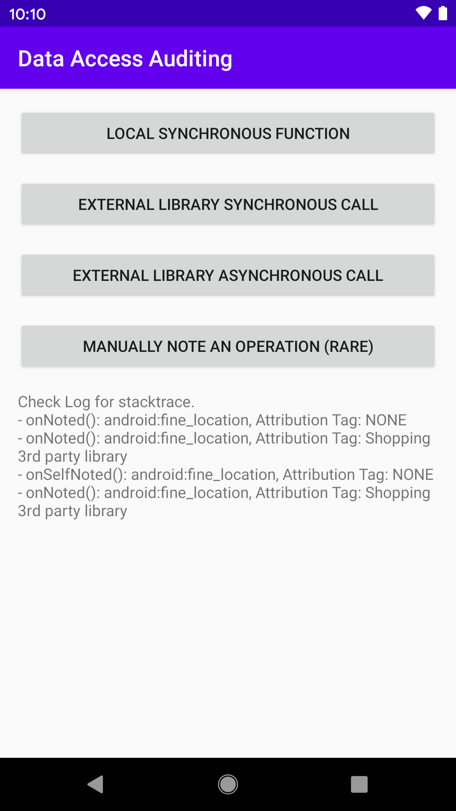

Android Data Access Auditing Sample (Kotlin)
===========================================

This sample demonstrates how to audit access to private data in your app via the data access
auditing APIs available in the Android 11 and above. This is really helpful when you have a very
large app or use a 3rd party library and you want to make sure it isn't accessing data in a way
you wouldn't expect.

Introduction
------------

To provide more transparency into how your app and its dependencies access private data from users,
Android 11 introduces data access auditing. By having insights from this process, you can better
identify and rectify potentially unexpected data access.

Your app can register an instance of `AppOpsManager.OnOpNotedCallback`, which can perform actions
each time one of the following events occurs:

- Your app's code accesses private data. To help you determine which logical part of your app
  invoked the event, you can audit data access by feature.
- Code in a dependent library or SDK accesses private data.

Data access auditing is invoked on the thread where the data request takes place. This means that,
if a 3rd-party SDK or library in your app calls an API that accesses private data, data access
auditing allows your OnOpNotedCallback to examine information about the call. Usually, this
collector object can tell whether the call came from your app or the SDK by looking at the app's
current status, such as the current thread's stack trace.

For more information, check out [the documentation](https://developer.android.com/preview/privacy/permissions#audit-by-feature).

Pre-requisites
--------------

- Android 11 SDK

Screenshots
-------------

Getting Started
---------------

This sample uses the Gradle build system. To build this project, use the
"gradlew build" command or use "Import Project" in Android Studio.

Support
-------

- Stack Overflow: http://stackoverflow.com/questions/tagged/android

If you've found an error in this sample, please file an issue:
https://github.com/android/permissions-samples

Patches are encouraged, and may be submitted by forking this project and
submitting a pull request through GitHub. Please see CONTRIBUTING.md for more details.
