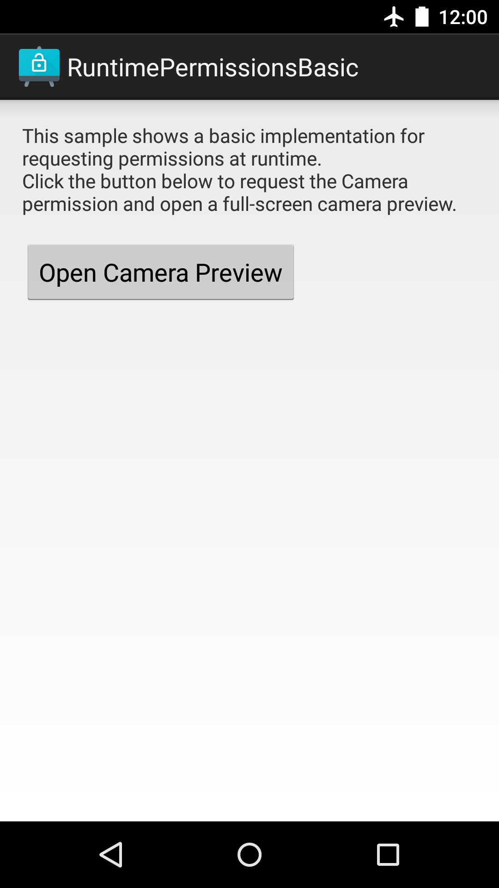

Android PermissionsActivityResultKotlin Sample
==============================================

This basic sample shows runtime permissions available in the Android using
[`registerForActivityResult`][1] It shows how to use the new runtime permissions API to check and
request permissions through the androidx.activity library.

Introduction
------------

Android 11 introduced new permissions behaviours, like "ask every time" option, and introduce a
default method [`ActivityResultContracts.RequestPermission()`][2]. 
The method take care of the main flows for the developer.
This sample introduces the basic use of the runtime permissions API through the androidx library by
verifying permissions [(ContextCompat#checkSelfPermission(Context, String))][3], requesting
permissions (ActivityResultContracts.RequestPermission()) and handling the permission request callback 
(androidx.activity.result.ActivityResultCaller.registerForActivityResult).
An application can display additional context and justification for a permission after calling
[ActivityCompat#shouldShowRequestPermissionRationale(Activity, String)][4].

See the "RuntimePermissions" sample for a more complete description and reference implementation.

Screenshots
-------------

 

Getting Started
---------------

This sample uses the Gradle build system. To build this project, use the
"gradlew build" command or use "Import Project" in Android Studio.

Support
-------

- Stack Overflow: http://stackoverflow.com/questions/tagged/android

If you've found an error in this sample, please file an issue:
https://github.com/android/permissions-samples

Patches are encouraged, and may be submitted by forking this project and
submitting a pull request through GitHub. Please see CONTRIBUTING.md for more details.

[1]: https://developer.android.com/reference/androidx/activity/result/ActivityResultCaller#registerForActivityResult(androidx.activity.result.contract.ActivityResultContract%3CI,%20O%3E,%20androidx.activity.result.ActivityResultCallback%3CO%3E)
[2]: https://developer.android.com/reference/androidx/activity/result/contract/ActivityResultContracts.RequestPermission
[3]: https://developer.android.com/reference/androidx/core/content/ContextCompat#checkSelfPermission(android.content.Context,%20java.lang.String)
[4]: https://developer.android.com/reference/androidx/core/app/ActivityCompat#shouldShowRequestPermissionRationale(android.app.Activity,%20java.lang.String)
